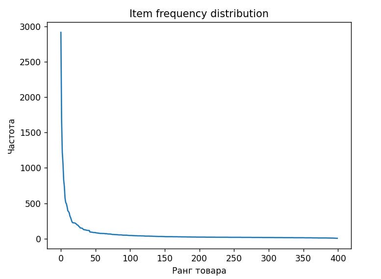
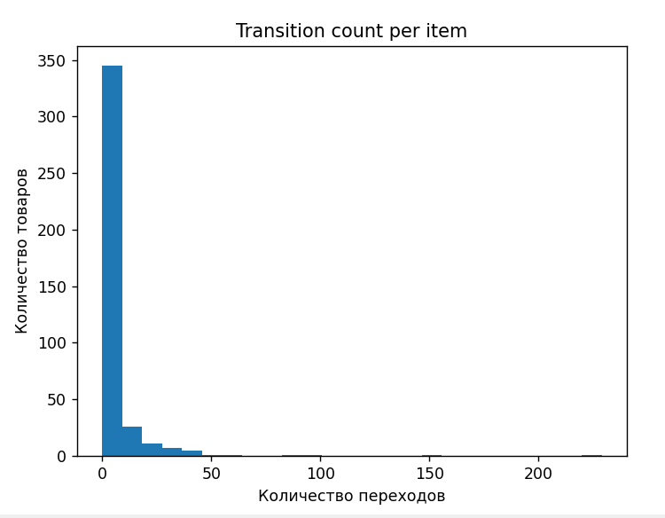
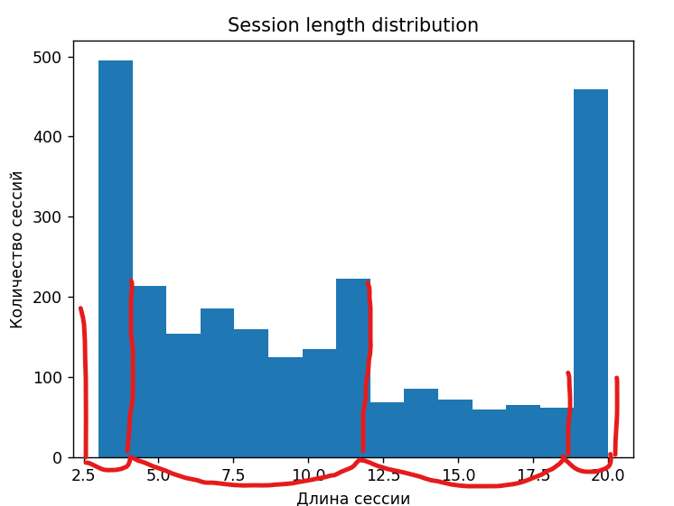

# recsys

## 1. Постановка задачи

Дан датасет пользовательских сессий.
Каждая сессия — это последовательность ID товаров вида 
```python
[335, 396, 156, 394]
```

Цель создать простую рек систему, которая предсказывает следующий товар для пользователя на основе его истории взаимодействия.
Проверка качества ранжирования осуществляется с помощью hit@10. Обучение модели происходит разбиением сессий датасета на обущающие (вся сессия кроме последнего элемента), а проверка качества ранжирования таргетными значениями (тот самый последний элемент каждой сессии)

## 2. Подготовка данных 

Я создал граф на первое время в формате словарь словарей 
```json
{
    380: {293: 99, 114: 90, 191: 4, 232: 2, ..., }
    293: {262: 13, 114: 180, 260: 9, 191: 26, 164: 2, 380: 47, 143: 3, 397: 5, 1: 5, ..., }
}
```

где по ключу номера товара находятся его соседи, а уже у них по ключу находится частота появления.
Затем я эту частоту разделил на количество ребер в каждом отдельном случае и тем самым получил вероятности. Далее отсортировал и переформатировал вложенные словари в списки из кортежей для удобства. 

Так же стоит отобрать самые популярные номера для нашего baseline и на случай, если в топ 10 не будет хватать кандидатов.

```python
def hit_at_k(
    recommendations: list[list[int]],
    true_items: list[int],
    k: int = 10,
) -> float:
    """
    Вычисление Hit@K для списка предсказаний.

    Parameters
    ----------
    recommendations : list of lists of ints
        recommendations[i] — ранжированный список
        рекомендаций для i-го примера.
    true_items : list of ints
        true_items[i] — истинный следующий товар
        для i-го примера.
    k : int
        Отсечка top-K (по умолчанию 10).

    Returns
    -------
    float
        Hit@K, значение от 0 до 1.
    """
    assert len(recommendations) == len(true_items), \
        "recommendations и true_items должны совпадать по длине"

    hits = 0
    for recs, true_item in zip(recommendations, true_items):
        if true_item in recs[:k]:
            hits += 1

    return hits / len(true_items)

def estimate_popular(model: Model, targets: list[int]) -> float:
    recs = []

    for i in range(len(targets)):
        recs.append(model.popular)
    
    result = hit_at_k(recs, targets)
    return result

def estimate(model: Model, trains: list[list[int]], targets: list[int]) -> float:
    recs = []

    for session in trains:
        last_item = session[-1]
        rec = model.forecast(last_item=last_item)
        recs.append(rec)
    
    result = hit_at_k(recs, targets)
    return result
```

```python
Hit@10 для модели: 0.5142300194931774
Hit@10 для popular baseline: 0.3840155945419103
```

вероятно, hit метрика могла быть немного ниже, но я заранее учел некоторые краевые случаи такие как петли, случай когда таргета не было в обучающих данных, когда кандидатов получилось меньше 10 и прочие


## 3. Анализ и улучшение

### Анализ частотности и количества переходов

Первым делом посчитал нужным посмотреть частотность товаров и в общем-то граф показал, почему baseline вышел 0.384



большинство товаров банально редкие, то есть те, что входят в popular, будут встречаться гораздо чаще. Отсюда и высокий score от метрики.
Для улучшения оценки можно было бы улучшать модель в этом направлении и повышать приоритетность популярных товаров, но я пошел в чуть-чуть другом направлении, что будет видно дальше



на данном же графе можно заметить, что данные разреженные. У большого количества товаров очень мало переходов, что создает много шума. Это натолкнуло меня на идею не учитывать переходы, которые буквально являются случайными

```python
# убираю шум (редкие, случайные переходы)
    def _delete_noise(self, count: int):
        for key in self.probabilities.keys():
            for new_key in list(self.probabilities[key].keys()):
                if self.probabilities[key][new_key] < count:
                    del self.probabilities[key][new_key]
    
    def create_graph(self, sessions: list[list[int]]): # на вход трейны, в классе создается граф 
        
        ...

        self._delete_noise(2) # для наглядности можно закомментить, прирост 1.4 процента
```
```python
Hit@10 для модели: 0.5282651072124757
```

вкратце, прирост велик


### Анализ длины сессий

Эта характеристика заинтересовала меня наиболее, поскольку я заметил интересную деталь.

Наблюдения:
- выраженный пик на коротких сессиях (3–4)
- второй пик на длинных сессиях (19–20)
- средние длины встречаются реже

к слову, 3 - минимальная длина сессии, а 20 - максимальная

на самом деле распределение такого формата довольно странное и не уверен что получив мы больше данных оно бы имело тот же вид, но оттолкнусь от того что вижу. Пик прослеживается при наименьшем и наибольшем количестве товаров, тогда как оставшиеся можно разделить на еще две группы и того получаем 4 группы



при анализе выяснилось, что в целом чем больше товаров в сессии, тем выше оценка hit@10, а именно 0.5148095909732017 для первой группы, 0.5249237029501526 для второй, 0.5458937198067633 для третьей и 0.5403050108932462 для четвертой. Я предположил, что это из-за того, что я добиваю нехватку возможных рекомендаций популярными, а это в свою очередь из-за маленького количества переходов упомянутого ранее (hit score popular составляет всего 0.3840155945419103, показатель то хороший, но настоящие данные были бы лучше).

```python
def forecast(self, train: list[int]) -> list[int]: # принимает трейны, возвращает топ 10 (self.n)
    if last_item not in self.probabilities:
        return self.popular[:self.n]
        
    if len(self.probabilities[last_item]) < self.n:
        # добиваем количество до 10 с помощью популярных
        top = []
        for items in self.probabilities[last_item]:
            if items[0] not in top:
                top.append(items[0])

        for item in self.popular:
            if item not in top:
                top.append(item)

        return top[:self.n]
    return [items[0] for items in self.probabilities[last_item][:self.n]]
```

Так я понял, что мне надо больше кандидатов и решил учитывать еще и предыдущий номер товара, а не только последний, но исключительно для тех случаев, где товаров в сессии <= 12. 

```python
def experiment_forecast(self, train: list[int]) -> list[int]:   # с prev для коротких сессий, так как я выяснил 
                                                                    # что для коротких сессий ниже hit score, предположительно из-за популярных
                                                                    # => надо уменьшить их количество
        last_item = train[-1]
        prev_item = train[-2] if len(train) > 1 else None

        seen = set() # чтобы постоянно не доставать элементы из top для проверки

        if last_item not in self.probabilities:
            return self.popular[:self.n]
        
        if len(self.probabilities[last_item]) < self.n:
            # добиваем количество до 10 с помощью популярных
            top = []
            for items in self.probabilities[last_item]:
                if items[0] not in seen:
                    top.append([items[0], items[1]])
                    seen.add(items[0])

            # если длина сессии маленькая, то используем prev
            if len(train) <= 12 and prev_item in self.probabilities:
                for items in self.probabilities[prev_item]:
                    if items[0] not in seen:
                        top.append([items[0], items[1]])
                        seen.add(items[0])
                    elif items[0] in seen:
                        for i in range(len(top)):
                            if top[i][0] == items[0]:
                                top[i][1] += 0.1
            
            if len(top) < self.n: # если все еще меньше то опять добиваем популярными
                for item in self.popular:
                    if item not in seen:
                        top.append([item, 0.01])

            return [items[0] for items in sorted(top, key=lambda x: -x[1])[:self.n]]
        return [items[0] for items in self.probabilities[last_item][:self.n]]
```
```python
Hit@10 для модели: 0.5321637426900585
Hit@10 для подгрупп: [0.5091678420310296, 0.5381485249237029, 0.5483091787439613, 0.5403050108932462]
```

```python
Прошлые значения: [0.5148095909732017, 0.5249237029501526, 0.5458937198067633, 0.5403050108932462]
```

Интересно, что хоть мы и добились улучшения общей оценки и оценки для второй группы, результат для первой - уменьшился. И даже логично, что предыдущий элемент не совсем бы помог, потому что в данной группе всего от 3 до 4 товаров, уровень шума высокий и сложно четко опираться на такой доп контекст. В связи с этим я добавил еще одно условие, чтобы применять контекст предыдущего товара только для второй группы (от 4 до 12 продуктов)

```python
if len(train) <= 12 and len(train) > 4 and prev_item in self.probabilities:
```

```python
Hit@10 для модели: 0.5337231968810916
Hit@10 для подгрупп: [0.5148095909732017, 0.5381485249237029, 0.5483091787439613, 0.5403050108932462]
```

Гипотеза подтвердилась

## Вывод

Для такой простой модели результат довольно хороший, к тому же как выяснилось мало данных в датасете. Чтобы лично посмотреть на графики можно зайти в файл main.py и убрать комментарии с 22 по 73 строку. Еще стоит упомянуть, что был граф, показывающий на какой из 10 позиций оказался target, но он не нашел применения